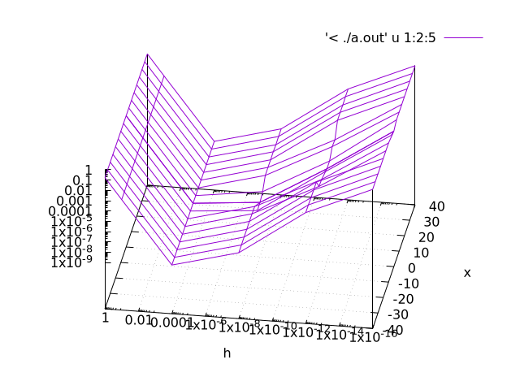

# GitHubの使われ方のサンプル


https://github.com/TeraTermProject/teraterm （おおもとのページ）

https://github.com/TeraTermProject/teraterm/releases/tag/v5.6.1 （リリースの何かの記載）


# Markdownの基本的な書き方


# 大見出し (#)
## 中見出し (##)
### 小見出し (###)

ふつうに文章を書けば、空行が段落の区切りになる。

次の段落です。

なお、行末に空白２個  
空白をいれると  
そこで改行してくれる。

文字装飾としては、**ボールド** や *斜体* や `インラインコード` がある。
インラインコードは `printf` などのような利用が多い。

> 引用するときは、先頭に \> を入れる。

この箇条書きは - or * です。
- りんご
  - 富士
  - じょな
  - > 引用はできる。テーブルは無理そう。
- みかん
  - じょいふる
  - らーく（箇条書きの子要素はスペースを空けて - or * ）
    - ラークα
      - ラーク1
        - ラークa
          - ラークΣ
            - ラークZ
* りんご
* みかん

数字番号の箇条書き（1. , 2. , 3. , ...とする。子・孫要素はできない？）
1. ひとつ目
2. ふたつ目
3. みっつ目

このようなコードブロックは \<pre>...\</pre> or \```...\``` とする。
\<pre> or \``` の前に \\ を書いて置いてエスケープできる。\\\[...](...) も可。
<pre>
int main(void){
    printf("hello\n");
}
</pre>

リンクは \[説明](URL) の形  
[OpenAI](https://openai.com)

画像の貼り付けは !\[説明](ファイル名)  



HTMLで画像を25%にして貼り付ける事ができる！？
<p align="center">
  
</p>

テーブル（横線を入れると上の行がボールドになるようだ）
| 名前 | 年齢 |
|---|---|
| 田中 | 20 |
| 佐藤 | 30 |

チェックマーク
- [ ] 未完了
- [x] 完了


# 以上です。

